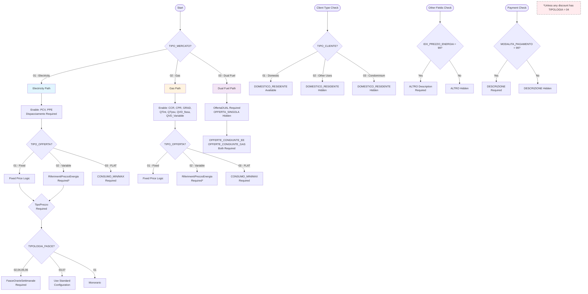
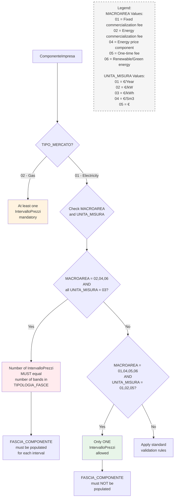

# Product Requirements Document (PRD)

## SII XML Energy Offer Generator

Version: 1.0  
Date: March 3, 2025

## 1. Introduction/Overview

The SII XML Energy Offer Generator is a web application designed to streamline the creation of energy and gas market offers for Italian energy providers. The application enables operators to input complex offer details through an intuitive multi-step interface, validates data according to strict SII (Sistema Informativo Integrato) requirements, and generates XML files compliant with the "Trasmissione Offerte" specification version 4.5.

This tool addresses the critical need for energy providers to submit properly formatted offers to the SII platform without requiring deep technical knowledge of XML or the complex validation rules. By providing real-time validation, contextual help, and a guided workflow, the application significantly reduces errors and submission rejections while improving operator efficiency.

## 2. Goals

1. **Simplify Offer Creation**: Provide an intuitive interface that guides operators through the complex process of creating energy/gas offers without requiring XML knowledge
2. **Ensure Compliance**: Validate all inputs against SII specification v4.5 requirements in real-time to prevent submission errors
3. **Reduce Error Rates**: Achieve <5% rejection rate for generated XML files when submitted to the SII platform
4. **Improve Efficiency**: Reduce the time to create a complete offer from hours to minutes
5. **Support All Offer Types**: Enable creation of all offer types specified in the SII documentation (electricity, gas, dual fuel)
6. **Maintain Data Integrity**: Ensure all conditional logic and complex validation rules are properly enforced

## 3. User Stories

1. **As an energy company operator**, I want to create a new electricity offer with multiple pricing components so that I can submit competitive offers to the market.

2. **As an energy company operator**, I want to see real-time validation errors with clear explanations so that I can fix issues immediately rather than after submission.

3. **As an energy company operator**, I want contextual help for complex fields like time bands and price intervals so that I understand how to format my data correctly.

4. **As an energy company operator**, I want to preview the generated XML before downloading so that I can verify all information is correct.

5. **As an energy company operator**, I want my form progress to be automatically saved in the URL so that I don't lose work if my browser crashes.

6. **As an energy company operator**, I want to navigate between form sections easily so that I can review and edit any part of the offer.

7. **As an energy company operator**, I want to see which sections are complete and which have errors so that I know what still needs attention.

## 4. Functional Requirements

### 4.1 Multi-Step Form Interface
1. The system must implement a step-by-step wizard interface using Stepperize
2. The system must display a progress indicator showing completed, current, and remaining steps
3. The system must allow navigation between steps while preserving entered data
4. The system must indicate validation status for each step (valid, invalid, not started)

### 4.2 Form Sections
The system must include the following form sections, each as a separate step:

1. **Basic Information** (Identificativi Offerta)
   - VAT Number (PIVA_UTENTE)
   - Offer Code (COD_OFFERTA)

2. **Offer Details** (DettaglioOfferta)
   - Market Type
   - Client Type
   - Offer Type
   - Contract Activation Types
   - Offer Name and Description
   - Duration and Guarantees

3. **Activation & Contacts**
   - Activation Methods
   - Contact Information (Phone, URLs)

4. **Pricing Configuration**
   - Energy Price References (for variable offers)
   - Price Types and Time Bands
   - Dispatching Components

5. **Company Components**
   - Component definitions with price intervals
   - Validity periods

6. **Payment & Conditions**
   - Payment Methods
   - Contractual Conditions
   - Regulated Components

7. **Additional Features**
   - Discounts
   - Geographic Zones
   - Additional Products/Services

8. **Validity & Review**
   - Offer Validity Dates
   - Final Review
   - XML Generation

### 4.3 State Management
1. The system must use NuQS to persist all form state in the URL
2. The system must support browser back/forward navigation
3. The system must allow sharing URLs with pre-filled form data
4. The system must handle deep linking to specific form sections

### 4.4 Form Validation
1. The system must use React Hook Form for form management
2. The system must use Zod schemas for validation matching SII requirements
3. The system must validate fields in real-time as users type
4. The system must display field-specific error messages
5. The system must enforce conditional validation rules (e.g., fields required based on other field values)
6. The system must prevent progression to next step if current step has errors

### 4.5 Dynamic Field Management
1. The system must show/hide fields based on conditional logic
2. The system must support repeatable sections (e.g., multiple payment methods)
3. The system must enforce minimum/maximum occurrences for repeatable fields
4. The system must dynamically adjust validation based on selected options

### 4.6 XML Generation
1. The system must generate XML files conforming to the provided XSD schema
2. The system must enforce the file naming convention: `<PIVA>_INSERIMENTO_<DESCRIPTION>.XML`
3. The system must use UTF-8 encoding
4. The system must validate generated XML against the schema before download
5. The system must provide both preview and download options

### 4.7 User Assistance
1. The system must provide inline help text for complex fields
2. The system must show format examples (e.g., time band format)
3. The system must explain conditional requirements
4. The system must highlight which fields are optional vs required
5. The system must provide tooltips with additional context

## 5. Non-Goals (Out of Scope)

1. **User Authentication**: No login or user management system
2. **Data Persistence**: Offers are not saved to a database
3. **Direct SII Integration**: No automatic submission to SII platform
4. **Bulk Operations**: No batch processing of multiple offers
5. **Offer Templates**: No pre-defined templates or offer library
6. **Historical Tracking**: No version history or audit trails
7. **Multi-language Support**: Only Italian language support
8. **API Endpoints**: No programmatic access via APIs
9. **Mobile App**: No native mobile applications

## 6. Design Considerations

### 6.1 UI/UX Requirements
1. Use a clean, modern design with clear visual hierarchy
2. Implement responsive design for desktop and tablet devices
3. Use color coding to indicate validation states (green=valid, red=error, yellow=warning)
4. Provide clear CTAs for navigation between steps
5. Show contextual examples and help text near complex fields
6. Use accordions or collapsible sections for optional/advanced fields

### 6.2 Component Architecture
1. Leverage Next.js App Router with Server Components where possible
2. Use Shadcn/ui components for consistent UI
3. Implement proper loading states during validation
4. Ensure form components are properly memoized for performance

### 6.3 Accessibility
1. Ensure WCAG 2.1 AA compliance
2. Provide proper ARIA labels for all form fields
3. Support keyboard navigation throughout the application:
   - Tab key for field navigation
   - Command/Ctrl + Arrow keys for step navigation
4. Ensure error messages are announced by screen readers

## 7. Technical Considerations

### 7.1 Technology Stack
- **Framework**: Next.js 15+ with App Router
- **State Management**: NuQS for URL state persistence
- **Form Management**: React Hook Form
- **Validation**: Zod schemas
- **Multi-step Forms**: Stepperize
- **UI Components**: Shadcn/ui
- **Styling**: Tailwind CSS

### 7.2 Performance Requirements
- Form pages must load within 2 seconds
- Field validation must occur within 100ms
- XML generation must complete within 5 seconds
- Support concurrent use by multiple operators

### 7.3 Browser Support
- Chrome (latest 2 versions)
- Firefox (latest 2 versions)
- Safari (latest 2 versions)
- Edge (latest 2 versions)

### 7.4 Data Validation Architecture
1. Implement Zod schemas that mirror the XSD structure
2. Create reusable validation functions for common patterns
3. Implement custom validators for complex business rules
4. Ensure client-side validation matches server-side generation

## 8. Conditional Rules from SII Specification

This section details all conditional validation rules that must be enforced based on the SII specification. These rules determine field visibility, mandatory status, and validation requirements based on other field values.

### 8.1 Market Type Dependencies

1. **OFFERTA_SINGOLA** (Single Offer)
   - Mandatory when: TIPO_MERCATO ≠ 03 (not Dual Fuel)
   - Hidden when: TIPO_MERCATO = 03

2. **OffertaDUAL Section**
   - Mandatory when: TIPO_MERCATO = 03 (Dual Fuel)
   - Hidden when: TIPO_MERCATO ≠ 03
   - Requires: Both OFFERTE_CONGIUNTE_EE and OFFERTE_CONGIUNTE_GAS fields

3. **Regulated Components**
   - Available codes depend on TIPO_MERCATO:
     - Electricity (01): PCV (01), PPE (02)
     - Gas (02): CCR (03), CPR (04), GRAD (05), QTint (06), QTpsv (07), QVD_fissa (09), QVD_Variabile (10)

4. **TipoPrezzo Section**
   - Mandatory when: TIPO_MERCATO = 01 (Electricity) AND TIPO_OFFERTA ≠ 03 (not FLAT)
   - Hidden otherwise

5. **Dispacciamento Section**
   - Mandatory when: TIPO_MERCATO = 01 (Electricity)
   - Hidden when: TIPO_MERCATO ≠ 01

### 8.2 Offer Type Dependencies

1. **RiferimentiPrezzoEnergia** (Energy Price References)
   - Mandatory when: TIPO_OFFERTA = 02 (Variable) AND no discount has TIPOLOGIA = 04
   - Hidden otherwise

2. **Consumption Limits**
   - CONSUMO_MIN and CONSUMO_MAX are mandatory when: TIPO_OFFERTA = 03 (FLAT)
   - Hidden when: TIPO_OFFERTA ≠ 03

### 8.3 Field Value Dependencies

1. **"Other" Description Fields**
   - ALTRO (in RiferimentiPrezzoEnergia) mandatory when: IDX_PREZZO_ENERGIA = 99
   - DESCRIZIONE (in ModalitaAttivazione) mandatory when: MODALITA = 99
   - DESCRIZIONE (in MetodoPagamento) mandatory when: MODALITA_PAGAMENTO = 99
   - VALORE_DISP mandatory when: TIPO_DISPACCIAMENTO = 99
   - ALTRO (in CondizioniContrattuali) mandatory when: TIPOLOGIA_CONDIZIONE = 99
   - DESCRIZIONE_CONDIZIONE (in Sconto) mandatory when: CONDIZIONE_APPLICAZIONE = 99
   - DETTAGLI_MACROAREA mandatory when: MACROAREA = 99 (in ProdottiServiziAggiuntivi)

2. **FasceOrarieSettimanale** (Weekly Time Bands)
   - Mandatory when: TIPOLOGIA_FASCE = 02, 04, 05, or 06
   - Optional when: TIPOLOGIA_FASCE = 03 or 07 (inherits standard configuration)
   - Hidden otherwise

### 8.4 Client Type Dependencies

1. **DOMESTICO_RESIDENTE** (Residential Status)
   - Available when: TIPO_CLIENTE = 01 (Domestic)
   - Hidden when: TIPO_CLIENTE ≠ 01

### 8.5 Component Dependencies

1. **ComponenteImpresa Rules for Gas (TIPO_MERCATO = 02)**
   - At least one IntervalloPrezzi is mandatory for each ComponenteImpresa

2. **ComponenteImpresa Rules for Electricity (TIPO_MERCATO = 01)**
   - If MACROAREA = 02, 04, or 06 AND all UNITA_MISURA = 03 (€/kWh):
     - Number of IntervalloPrezzi must equal number of bands in TIPOLOGIA_FASCE
     - FASCIA_COMPONENTE must be populated for each interval
   - If MACROAREA = 01, 04, 05, or 06 AND UNITA_MISURA = 01, 02, or 05:
     - Only one IntervalloPrezzi allowed
     - FASCIA_COMPONENTE must NOT be populated

### 8.6 Discount Rules

1. **PeriodoValidita vs VALIDITA**
   - VALIDITA field is mandatory when PeriodoValidita section is NOT populated
   - When PeriodoValidita is populated, VALIDITA should be hidden/optional

2. **Discount Application**
   - At least one PREZZISconto section is mandatory for each Sconto

### 8.7 Date-Based Rules

1. **Early Withdrawal Charges**
   - TIPOLOGIA_CONDIZIONE = 05 can only be used starting from January 1, 2024

### 8.8 Visual Representation

The following Mermaid diagram illustrates the primary conditional logic flow:

This diagram shows the primary decision trees for field requirements. Additional conditional rules apply within each section as detailed in subsections 8.1-8.7.

### 8.9 Component Pricing Rules Diagram

The following diagram details the complex conditional rules for ComponenteImpresa pricing intervals:

### 8.10 Implementation Notes

1. **Validation Order**: Field dependencies should be evaluated in the order they appear in the form to ensure proper cascading of requirements
2. **Dynamic Updates**: When a field value changes, all dependent fields must be re-evaluated for visibility and validation rules
3. **Error Messages**: When a conditional rule makes a field required, the error message should explain why (e.g., "This field is required when Market Type is Electricity")
4. **State Management**: The URL state management via NuQS must properly handle hiding/showing fields without losing previously entered data

## 9. Success Metrics

1. **Error Rate**: <5% of generated XML files rejected by SII platform
2. **Time Efficiency**: Average time to create an offer reduced by 70%
3. **User Satisfaction**: >4.5/5 rating in user satisfaction surveys
4. **Validation Accuracy**: 100% of validation rules correctly implemented
5. **Form Completion Rate**: >90% of started forms successfully generate XML
6. **Support Tickets**: <10% of users require support assistance

## 10. Clarified Decisions

Based on stakeholder feedback, the following decisions have been made:

1. **Browser Storage**: The system will rely solely on URL state via NuQS, without additional localStorage backup
2. **Validation Timing**: All validations will occur in real-time for immediate feedback
3. **Error Recovery**: The system will handle corrupted URL state by defaulting to an empty form
4. **Field Dependencies**: The system will implement only the conditional rules documented in the SII specification
5. **Future Integrations**: The current architecture will not include provisions for future SII API integration
6. **Offline Support**: No offline capability is required
7. **Export Formats**: The system will only support XML format as specified by SII
8. **Keyboard Shortcuts**: The system will implement:
   - **Tab**: Navigate between form fields
   - **Command + Arrow Keys**: Navigate between form steps (where possible) 