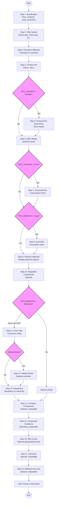

# SII XML Offer Generator – Product Requirements Document (PRD)

## 1. Introduction / Overview

The **SII XML Offer Generator** is a web-based wizard that streamlines the creation of electricity and gas market offer files compliant with the Italian "Sistema Informativo Integrato" (SII) specification, version 4.5. Today, compliance specialists must read a 200-page specification and manually build XML files, a process that is error-prone and time-consuming. This tool will guide internal pricing and marketing staff through a step-by-step form, validate inputs in real-time, and output a schema-valid XML file ready for upload to the SII portal. The goal is to eliminate manual XML editing and reduce compliance errors.

## 2. Goals

1. Reduce average offer creation time from hours to under **5 minutes**.
2. Ensure **100 %** of generated XML files pass official XSD validation on the first attempt.
3. Provide clear, inline validation messages so users can correct data before export.
4. Offer a frictionless, no-login experience that works entirely in-browser.

## 3. User Stories

1. **As an internal marketer**, I can complete a simple wizard without reading the SII spec so that I can quickly prepare a new commercial offer.
2. **As an internal marketer**, I can download a SII-compliant XML file for each offer created so that I can submit it to the regulator with confidence.
3. **As an internal marketer**, I can share my work-in-progress offer via URL so that colleagues can review or continue editing.
4. **As an internal marketer**, I can refresh the page without losing my progress so that I can work without fear of data loss.

## 4. Functional Requirements

### 4.1 General Requirements

1. **Step-by-Step Wizard** – The system SHALL guide the user through all required SII sections using a stepper UI component (see Technical Considerations).
2. **Inline Validation** – Each field SHALL validate length, datatype, enumerated values, and conditional logic using Zod schemas. Errors MUST display next to the offending field and revalidate on mount/changes.
3. **XML Preview** – The system SHALL render a live, read-only XML preview that updates on each form change.
4. **Download XML** – The system SHALL allow the user to download the generated XML file using the naming convention `<PIVA_UTENTE>_<AZIONE>_<DESCRIZIONE>.XML`.
5. **Client-Side Execution & URL State** – All logic (form state, validation, XML generation) SHALL run fully in the browser. Wizard state MUST persist entirely in the URL using **NuQS** with JSON serialization per step. Each step's data SHALL be stored as a separate URL parameter (e.g., `?s1={...}&s2={...}`).
6. **Abbreviated Field Names** – To optimize URL length, the system SHALL use abbreviated field names in URL parameters and remap them to full names internally using NuQS key mapping.
7. **Performance Optimization** – The system SHALL implement:
   - Debounced input changes before URL updates
   - Batch multiple field updates into single URL updates
   - Use `shallow: false` updates only when necessary
   - Save state to URL only before navigating to next step
8. **State Management** – The system SHALL:
   - Only include fields that differ from defaults using `clearOnDefault: true`
   - Provide both "Clear All" and "Reset to Defaults" options
   - Allow sharing URLs that restore the exact wizard state
9. **Accessibility** – The wizard SHOULD support keyboard navigation and screen-reader labels.

### 4.2 URL State Structure

The system SHALL organize state in the URL using the following pattern:
- `?s1={step1Data}&s2={step2Data}&...&s18={step18Data}`

Each step parameter SHALL contain a JSON object with abbreviated field names. Example field name mappings:
- PIVA_UTENTE → piva
- COD_OFFERTA → cod
- TIPO_MERCATO → tm
- OFFERTA_SINGOLA → os
- TIPO_CLIENTE → tc
- DOMESTICO_RESIDENTE → dr
- TIPO_OFFERTA → to
- TIPOLOGIA_ATT_CONTR → tac
- NOME_OFFERTA → nome
- DESCRIZIONE → desc
- DURATA → dur
- GARANZIE → gar

### 4.3 Validation Architecture

1. **Zod Schemas** – Each step SHALL have a corresponding Zod schema that validates all fields according to SII requirements.
2. **Real-time Validation** – Fields SHALL validate on blur and display errors inline.
3. **Step Validation** – Before proceeding to the next step, the current step MUST pass validation.
4. **No URL Error State** – Validation errors SHALL NOT be stored in the URL; they SHALL be recalculated on mount and field changes.

### 4.2 Detailed Field Requirements

#### 4.2.1 Step 1: Identification Information (Identificativi Offerta)

The system SHALL collect:
- **PIVA_UTENTE** (VAT Number): Alphanumeric, max 16 characters, mandatory
- **COD_OFFERTA** (Offer Code): Alphanumeric, max 32 characters, mandatory. This is the unique code that will be used in the CODICE CONTRATTO field during subscription

#### 4.2.2 Step 2: Offer Details (DettaglioOfferta)

The system SHALL collect:

- **TIPO_MERCATO** (Market Type): Mandatory, Alphanumeric(2)
  - 01 = Electricity
  - 02 = Gas  
  - 03 = Dual Fuel

- **OFFERTA_SINGOLA** (Individual Offer): Mandatory if TIPO_MERCATO ≠ 03, Alphanumeric(2)
  - SI = Can be subscribed individually
  - NO = Only in combination with another commodity

- **TIPO_CLIENTE** (Client Type): Mandatory, Numeric(2)
  - 01 = Domestic
  - 02 = Other Uses
  - 03 = Residential Condominium (Gas)

- **DOMESTICO_RESIDENTE** (Residential Status): Optional, Alphanumeric(2)
  - 01 = Domestic Resident
  - 02 = Domestic Non-Resident
  - 03 = All types

- **TIPO_OFFERTA** (Offer Type): Mandatory, Numeric(2)
  - 01 = Fixed
  - 02 = Variable
  - 03 = FLAT

- **TIPOLOGIA_ATT_CONTR** (Contract Activation Types): Mandatory, Numeric(2), can occur multiple times
  - 01 = Supplier Change
  - 02 = First Activation (Meter not present)
  - 03 = Reactivation (Meter present but deactivated)
  - 04 = Contract Transfer
  - 99 = Always

- **NOME_OFFERTA** (Offer Name): Mandatory, Alphanumeric(255)

- **DESCRIZIONE** (Description): Mandatory, Alphanumeric(3000)

- **DURATA** (Duration in months): Mandatory, Numeric(2)
  - -1 = Indeterminate duration
  - 1-99 = Specific duration

- **GARANZIE** (Guarantees): Mandatory, Alphanumeric(3000). "NO" if no guarantees required

#### 4.2.3 Step 3: Activation Methods (ModalitaAttivazione)

The system SHALL collect:

- **MODALITA** (Activation Method): Mandatory, Alphanumeric(2), can occur multiple times
  - 01 = Web-only activation
  - 02 = Any channel activation
  - 03 = Point of sale
  - 04 = Teleselling
  - 05 = Agency
  - 99 = Other

- **DESCRIZIONE**: Mandatory when MODALITA = 99, Alphanumeric(2000)

#### 4.2.4 Step 4: Contact Information (Contatti)

The system SHALL collect:
- **TELEFONO** (Phone): Mandatory, Alphanumeric(15)
- **URL_SITO_VENDITORE** (Vendor Website): Mandatory if available, Alphanumeric(100)
- **URL_OFFERTA** (Offer URL): Mandatory if available, Alphanumeric(100)

#### 4.2.5 Step 5: Energy Price References (RiferimentiPrezzoEnergia)

This section is mandatory only if TIPO_OFFERTA = 02 (Variable) and SCONTO/TIPOLOGIA ≠ 04.

- **IDX_PREZZO_ENERGIA** (Price Index): Numeric(2)
  - Quarterly: 01=PUN, 02=TTF, 03=PSV, 04=Psbil, 05=PE, 06=Cmem, 07=Pfor
  - Bimonthly: 08=PUN, 09=TTF, 10=PSV, 11=Psbil
  - Monthly: 12=PUN, 13=TTF, 14=PSV, 15=Psbil
  - 99 = Other (not managed by Portal)

- **ALTRO**: Mandatory when IDX_PREZZO_ENERGIA = 99, Alphanumeric(3000)

#### 4.2.6 Step 6: Offer Validity (ValiditaOfferta)

The system SHALL collect:
- **DATA_INIZIO** (Start Date): Mandatory, format DD/MM/YYYY_HH:MM:SS
- **DATA_FINE** (End Date): Mandatory, format DD/MM/YYYY_HH:MM:SS

#### 4.2.7 Step 7: Offer Characteristics (CaratteristicheOfferta)

The system SHALL collect:
- **CONSUMO_MIN** (Min Consumption): Mandatory if TIPO_OFFERTA = 03, Numeric(9)
- **CONSUMO_MAX** (Max Consumption): Mandatory if TIPO_OFFERTA = 03, Numeric(9)
- **POTENZA_MIN** (Min Power): Optional, Numeric(2,1) with decimal separator '.'
- **POTENZA_MAX** (Max Power): Optional, Numeric(2,1) with decimal separator '.'

#### 4.2.8 Step 8: Dual Offer (OffertaDUAL)

This section is mandatory if TIPO_MERCATO = 03.

- **OFFERTE_CONGIUNTE_EE** (Electricity Offer Codes): Alphanumeric(32), can occur multiple times
- **OFFERTE_CONGIUNTE_GAS** (Gas Offer Codes): Alphanumeric(32), can occur multiple times

#### 4.2.9 Step 9: Payment Methods (MetodoPagamento)

The system SHALL collect multiple payment methods:

- **MODALITA_PAGAMENTO**: Mandatory, Alphanumeric(2), can occur multiple times
  - 01 = Bank direct debit
  - 02 = Postal direct debit
  - 03 = Credit card direct debit
  - 04 = Pre-filled bulletin
  - 99 = Other

- **DESCRIZIONE**: Mandatory when MODALITA_PAGAMENTO = 99, Alphanumeric(25)

#### 4.2.10 Step 10: Regulated Components (ComponentiRegolate)

Optional section. The system SHALL allow selection of:

- **CODICE**: Alphanumeric(2), can occur multiple times
  - For Electricity: 01=PCV, 02=PPE
  - For Gas: 03=CCR, 04=CPR, 05=GRAD, 06=QTint, 07=QTpsv, 09=QVD_fissa, 10=QVD_Variabile

#### 4.2.11 Step 11: Price Type (TipoPrezzo)

This section is mandatory if TIPO_MERCATO = 01 and TIPO_OFFERTA ≠ 03.

- **TIPOLOGIA_FASCE** (Time Band Configuration): Alphanumeric(2)
  - 01 = Monorario
  - 02 = F1, F2
  - 03 = F1, F2, F3 (Standard 3 bands)
  - 04 = F1, F2, F3, F4
  - 05 = F1, F2, F3, F4, F5
  - 06 = F1, F2, F3, F4, F5, F6
  - 07 = Peak/OffPeak (Standard peak/off-peak)
  - 91 = Biorario (F1 / F2+F3)
  - 92 = Biorario (F2 / F1+F3)
  - 93 = Biorario (F3 / F1+F2)

#### 4.2.12 Step 12: Weekly Time Bands (FasceOrarieSettimanale)

This section is mandatory if TIPOLOGIA_FASCE = 02, 04, 05, or 06.

For each day, collect time band configuration in format: `XXI-YI,XXII-YII,..,XXN-YN`
- XXi: Last quarter hour of band application (1-96)
- Yi: Band number (1-8, where 7=Peak, 8=OffPeak)
- Must verify: XXi+1 > XXi and N ≤ 10

Fields (all Alphanumeric(49)):
- F_LUNEDI (Monday)
- F_MARTEDI (Tuesday)
- F_MERCOLEDI (Wednesday)
- F_GIOVEDI (Thursday)
- F_VENERDI (Friday)
- F_SABATO (Saturday)
- F_DOMENICA (Sunday)
- F_FESTIVITA (Holidays)

#### 4.2.13 Step 13: Dispatching (Dispacciamento)

This section is mandatory if TIPO_MERCATO = 01, can occur multiple times.

- **TIPO_DISPACCIAMENTO**: Mandatory, Numeric(2)
  - 01 = Disp. del.111/06
  - 02 = PD
  - 03 = MSD
  - 04 = Modulazione Eolico
  - 05 = Unità essenziali
  - 06 = Funz. Terna
  - 07 = Capacità Produttiva
  - 08 = Interrompibilità
  - 09 = Corrispettivo Capacità di Mercato STG
  - 10 = Corrispettivo capacità di mercato MT
  - 11 = Reintegrazione oneri salvaguardia
  - 12 = Reintegrazione oneri tutele graduali
  - 13 = DispBT (only in Portal calculation if selected)
  - 99 = Altro

- **VALORE_DISP**: Mandatory if TIPO_DISPACCIAMENTO = 99, Numeric(1,6) with decimal '.'
- **NOME**: Mandatory, Alphanumeric(25)
- **DESCRIZIONE**: Optional, Alphanumeric(255)

#### 4.2.14 Step 14: Company Components (ComponenteImpresa)

Optional section, can occur multiple times.

- **NOME**: Mandatory, Alphanumeric(255)
- **DESCRIZIONE**: Mandatory, Alphanumeric(255)
- **TIPOLOGIA**: Mandatory, Alphanumeric(2)
  - 01 = STANDARD (Price included)
  - 02 = OPTIONAL (Price not included)
- **MACROAREA**: Mandatory, Numeric(2)
  - 01 = Fixed commercialization fee
  - 02 = Energy commercialization fee
  - 04 = Energy price component
  - 05 = One-time fee
  - 06 = Renewable energy / Green energy

For each component, add price intervals (IntervalloPrezzi):
- **FASCIA_COMPONENTE**: Optional, Alphanumeric(2)
  - 01=Monorario/F1, 02=F2, 03=F3, 04=F4, 05=F5, 06=F6
  - 07=Peak, 08=OffPeak, 91=F2+F3, 92=F1+F3, 93=F1+F2
- **CONSUMO_DA**: Optional, Numeric(9)
- **CONSUMO_A**: Optional, Numeric(9)
- **PREZZO**: Mandatory, Numeric(6,6)
- **UNITA_MISURA**: Mandatory, Numeric(2)
  - 01=€/Year, 02=€/kW, 03=€/kWh, 04=€/Sm3, 05=€

Each price interval can have validity period (PeriodoValidita):
- **DURATA**: Optional, Numeric(2)
- **VALIDO_FINO**: Optional, format MM/YYYY
- **MESE_VALIDITA**: Optional, Numeric(2), multiple: 01=January...12=December

Special validation rules:
- For Gas: ComponenteImpresa/IntervalloPrezzi is mandatory for each ComponenteImpresa
- For Electricity with MACROAREA=02,04,06 and UNITA_MISURA=03: Must have IntervalloPrezzi count = TIPOLOGIA_FASCE band count
- For Electricity with MACROAREA=01,04,05,06 and UNITA_MISURA=01,02,05: Single IntervalloPrezzi without FASCIA_COMPONENTE

#### 4.2.15 Step 15: Contractual Conditions (CondizioniContrattuali)

Mandatory section, can occur multiple times.

- **TIPOLOGIA_CONDIZIONE**: Mandatory, Alphanumeric(2)
  - 01 = Activation
  - 02 = Deactivation
  - 03 = Withdrawal
  - 04 = Multi-year Offer
  - 05 = Early Withdrawal Charges (from Jan 1, 2024)
  - 99 = Other

- **ALTRO**: Mandatory if TIPOLOGIA_CONDIZIONE = 99, Alphanumeric(20)
- **DESCRIZIONE**: Mandatory, Alphanumeric(3000)
- **LIMITANTE**: Mandatory, Alphanumeric
  - 01 = Yes, it is limiting
  - 02 = No, it is not limiting

#### 4.2.16 Step 16: Offer Zones (ZoneOfferta)

Optional section for geographical availability.

- **REGIONE**: Optional, Alphanumeric(2), multiple, each code Numeric(2)
- **PROVINCIA**: Optional, Alphanumeric(3), multiple, each code Numeric(3)
- **COMUNE**: Optional, Alphanumeric(6), multiple, each code Numeric(6)

#### 4.2.17 Step 17: Discounts (Sconto)

Optional section, can occur multiple times.

- **NOME**: Mandatory, Alphanumeric(255)
- **DESCRIZIONE**: Mandatory, Alphanumeric(3000)
- **CODICE_COMPONENTE_FASCIA**: Optional, Alphanumeric(2), multiple
  - Components: 01-10 (same as ComponentiRegolate)
  - Bands: 11=F1...16=F6, 17=Peak, 18=OffPeak, 91=F2+F3, 92=F1+F3, 93=F1+F2
- **VALIDITA**: Mandatory if PeriodoValidita not populated, Alphanumeric(2)
  - 01 = Entry
  - 02 = Within 12 months
  - 03 = Beyond 12 months
- **IVA_SCONTO**: Mandatory, Alphanumeric(2)
  - 01 = Yes
  - 02 = No

Each discount has validity period (same as ComponenteImpresa) and condition:
- **CONDIZIONE_APPLICAZIONE**: Mandatory, Alphanumeric(2)
  - 00 = Not conditioned
  - 01 = Electronic billing
  - 02 = Online management
  - 03 = Electronic billing + bank direct debit
  - 99 = Other
- **DESCRIZIONE_CONDIZIONE**: Mandatory if CONDIZIONE_APPLICAZIONE = 99, Alphanumeric(3000)

Each discount has prices (PREZZISconto), at least one, can be multiple:
- **TIPOLOGIA**: Mandatory, Numeric(2)
  - 01 = Fixed discount
  - 02 = Power discount
  - 03 = Sales discount
  - 04 = Discount on regulated price
- **VALIDO_DA**: Optional, Numeric(9)
- **VALIDO_FINO**: Optional, Numeric(9)
- **UNITA_MISURA**: Mandatory, Numeric(2): 01-06 (same as ComponenteImpresa plus 06=Percentage)
- **PREZZO**: Mandatory, Numeric(6,6)

#### 4.2.18 Step 18: Additional Products and Services (ProdottiServiziAggiuntivi)

Optional section, can occur multiple times.

- **NOME**: Mandatory, Alphanumeric(255)
- **DETTAGLIO**: Mandatory, Alphanumeric(3000)
- **MACROAREA**: Optional, Numeric(2)
  - 01 = Boiler
  - 02 = Mobility
  - 03 = Solar thermal
  - 04 = Photovoltaic
  - 05 = Air conditioning
  - 06 = Insurance policy
  - 99 = Other
- **DETTAGLI_MACROAREA**: Mandatory if MACROAREA = 99, Alphanumeric(100)

## 5. Non-Goals / Out of Scope (Release 1)

* User authentication or account management.
* Direct submission of XML files to the SII portal.
* Auto-saving draft offers via mechanisms other than URL (e.g., LocalStorage, IndexedDB, backend DB).
* Integrations with external CRM or pricing systems.

## 6. Design Considerations

* Adopt a **clean, minimal wizard layout** with clearly labeled steps and breadcrumb progress.
* Use standard Next.js / React components with Tailwind or simple CSS modules—avoid heavy custom styling.
* Keep field groupings consistent with SII document chapter order to aid familiarity.
* **Localization**: All user interface text, labels, error messages, help text, and instructions MUST be in Italian language to match the target audience and SII documentation.

## 7. Technical Considerations

* **Framework**: Next.js 15 App Router, leveraging Server & Client Components best practices.
* **UI Components**: Leverage existing components from `@/components/ui` folder (form, input, select, radio-group, checkbox, button, card, alert, dialog, tabs, etc.). Limit creation of new custom components unless strictly necessary for specific SII requirements.
* **Stepper Management**: Utilize the **Stepperize** library to orchestrate multi-step navigation, validation gating, and progress display. Step navigation state SHALL be managed by Stepperize independently from URL state.
* **State Management**: 
  - **NuQS** for all application state with JSON serialization using `parseAsJson` with Zod validation
  - One URL parameter per wizard step (s1, s2, ..., s18)
  - Custom hooks wrapping `useQueryState` for each step with:
    - Abbreviated field name mappings
    - Default values
    - Zod schema validation
    - Type-safe interfaces
  - Performance optimizations:
    - Debounced updates for text inputs
    - Batch updates for related fields
    - State persistence to URL on step navigation
* **Validation**: 
  - **Zod** schemas for each step matching SII requirements
  - Validation on field blur and before step navigation
  - Error messages in Italian
  - No validation state in URL (recalculate on mount)
* **XML Generation**: Implement a pure TypeScript utility that maps form state to DOM objects and serializes to UTF-8 XML. Use the provided `xml-schema.xsd` for validation (via an in-browser XSD validator such as `xsd-schema-validator` compiled to WASM).
* **Type Safety**: 
  - Strict TypeScript interfaces for all URL parameters
  - Zod schema inference for form data types
  - Mapped types for abbreviated → full field names
* **Testing**: Unit tests for validation rules; integration test that generates a sample offer and asserts XSD validity.

## 8. Success Metrics

| Metric | Target |
| --- | --- |
| XSD validation pass rate | 100 % on first attempt |
| Average wizard completion time | ≤ 5 minutes |
| Validation error clarity (user survey) | ≥ 90 % users rate "clear" or better |

## 9. Wizard Flow Diagram


```mermaid
flowchart TD
    Start([Start]) --> Step1[Step 1: Identification<br/>PIVA_UTENTE, COD_OFFERTA]
    Step1 --> Step2[Step 2: Offer Details<br/>Market type, Client type, etc.]
    Step2 --> Step3[Step 3: Activation Methods<br/>Channels for activation]
    Step3 --> Step4[Step 4: Contact Info<br/>Phone, URLs]
    
    Step4 --> CheckVariable{TIPO_OFFERTA = Variable?}
    CheckVariable -->|Yes| Step5[Step 5: Energy Price References<br/>Price indices]
    CheckVariable -->|No| Step6
    Step5 --> Step6
    
    Step6[Step 6: Offer Validity<br/>Start/End dates]
    
    Step6 --> CheckFlat{TIPO_OFFERTA = FLAT?}
    CheckFlat -->|Yes| Step7[Step 7: Characteristics<br/>Consumption limits]
    CheckFlat -->|No| CheckDual
    Step7 --> CheckDual
    
    CheckDual{TIPO_MERCATO = Dual?}
    CheckDual -->|Yes| Step8[Step 8: Dual Offer<br/>Associated codes]
    CheckDual -->|No| Step9
    Step8 --> Step9
    
    Step9[Step 9: Payment Methods<br/>Multiple payment options]
    Step9 --> Step10[Step 10: Regulated Components<br/>Optional]
    
    Step10 --> CheckElec{TIPO_MERCATO = Electricity?}
    CheckElec -->|Yes & not FLAT| Step11[Step 11: Price Type<br/>Time band config]
    CheckElec -->|No| Step13Opt
    Step11 --> CheckBands
    
    CheckBands{Special bands?}
    CheckBands -->|Yes| Step12[Step 12: Weekly Bands<br/>Detailed schedule]
    CheckBands -->|No| Step13
    Step12 --> Step13
    
    Step13[Step 13: Dispatching<br/>Mandatory for electricity]
    Step13 --> Step14
    
    Step13Opt[Optional Steps]
    Step13Opt --> Step14
    
    Step14[Step 14: Company Components<br/>Optional, repeatable]
    Step14 --> Step15[Step 15: Contractual Conditions<br/>Mandatory, repeatable]
    Step15 --> Step16[Step 16: Offer Zones<br/>Optional geographical limits]
    Step16 --> Step17[Step 17: Discounts<br/>Optional, repeatable]
    Step17 --> Step18[Step 18: Additional Services<br/>Optional, repeatable]
    
    Step18 --> Preview[XML Preview & Download]
    Preview --> End([End])
    
    style CheckVariable fill:#f9f,stroke:#333,stroke-width:2px
    style CheckFlat fill:#f9f,stroke:#333,stroke-width:2px
    style CheckDual fill:#f9f,stroke:#333,stroke-width:2px
    style CheckElec fill:#f9f,stroke:#333,stroke-width:2px
    style CheckBands fill:#f9f,stroke:#333,stroke-width:2px
```

## 10. Implementation Example

Example of step hook implementation:

```typescript
// hooks/steps/useStep1.ts
import { parseAsJson } from 'nuqs'
import { z } from 'zod'

const step1Schema = z.object({
  piva: z.string().max(16).regex(/^[A-Z0-9]+$/),
  cod: z.string().max(32).regex(/^[A-Z0-9]+$/)
})

export function useStep1() {
  const [data, setData] = useQueryState('s1', 
    parseAsJson(step1Schema.parse)
      .withDefault({ piva: '', cod: '' })
      .withOptions({ clearOnDefault: true })
  )
  
  return {
    data,
    setData,
    validate: () => step1Schema.safeParse(data)
  }
}
```

## 11. Open Questions

1. Should we implement URL compression (e.g., lz-string) if users create very complex offers that exceed URL length limits?
2. Should the XML preview auto-update with every keystroke or only on step completion?
3. Should we implement an import feature to load data from previously generated XML files?